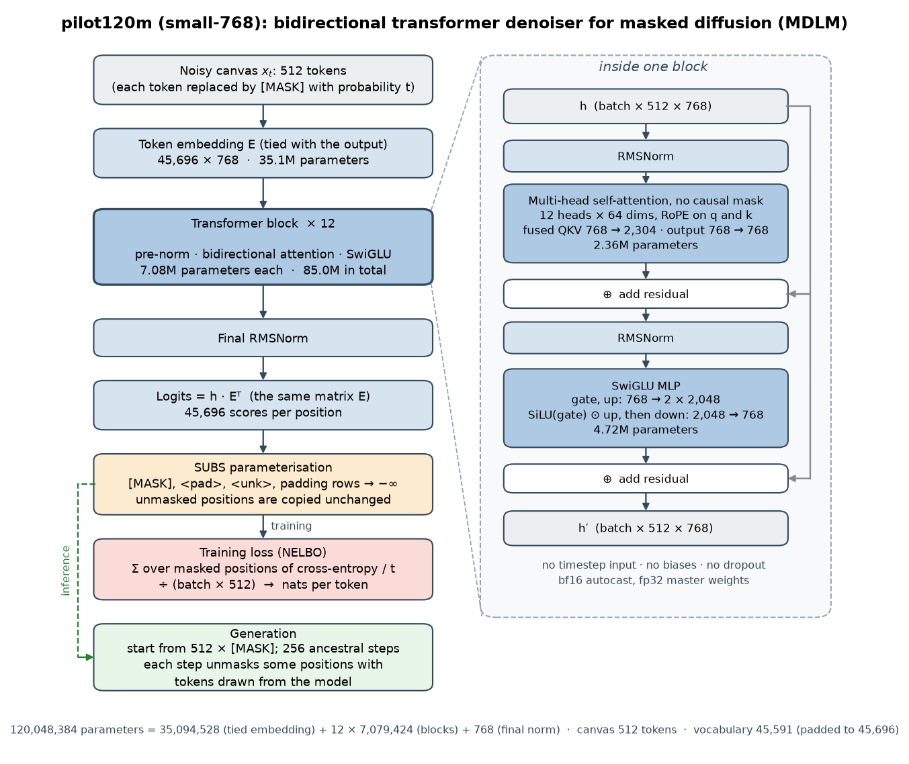
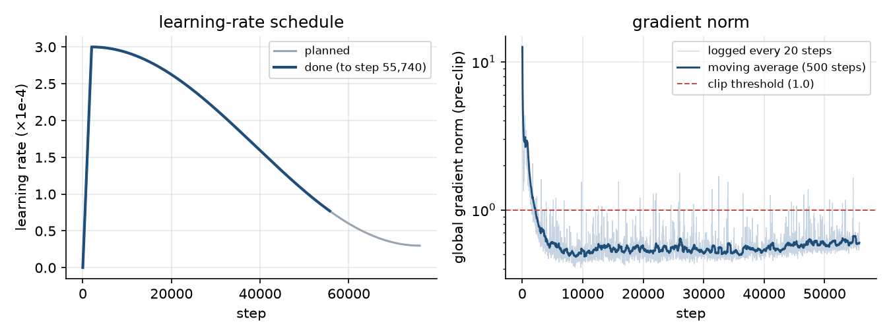
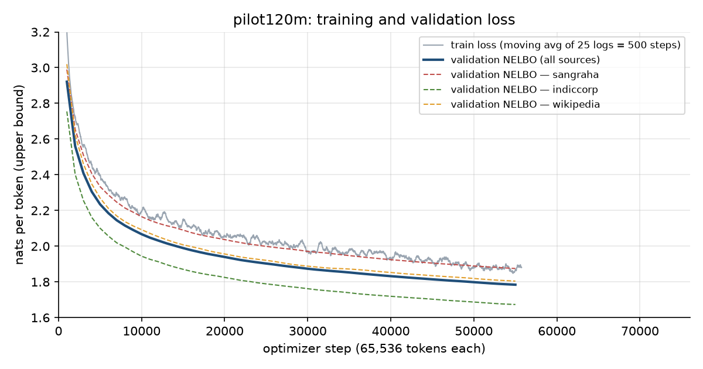
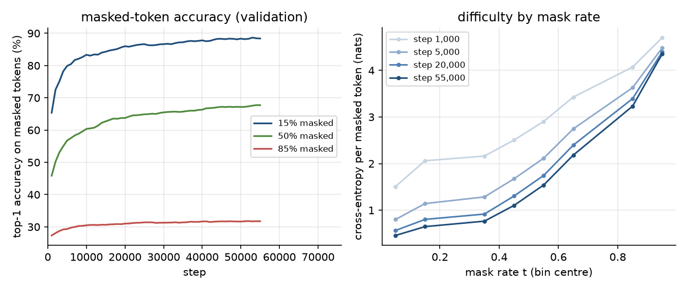
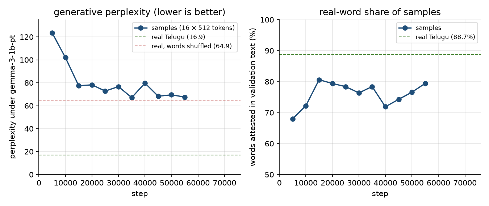

# Telugu MDLM pretraining: `pilot120m` training report

**Status: training in progress.** These are interim numbers as of **2026-09-28 14:45 IST**, at
step 55,700 of 76,000 (73%) with 3.65B of 4.98B tokens seen. The run is expected to finish
around 08:30–09:00 IST on 2026-09-29, after which this report will be updated with final
numbers.

The code is in this folder (`mdlm/`, `data_prep/`, `tokenizer/`). The run writes its outputs to
`runs/pilot120m/`, which is not tracked by git. All figures are drawn from the run's logs by
[`make_report_figures.py`](make_report_figures.py).

**Contents**

1. [Summary](#1-summary)
2. [Training strategy](#2-training-strategy)
3. [Architecture](#3-architecture)
4. [Diffusion objective and sampling](#4-diffusion-objective-and-sampling)
5. [Training data](#5-training-data)
6. [Tokenizer](#6-tokenizer)
7. [Training hyperparameters](#7-training-hyperparameters)
8. [Infrastructure and fault tolerance](#8-infrastructure-and-fault-tolerance)
9. [Evaluation protocol](#9-evaluation-protocol)
10. [Results so far](#10-results-so-far)
11. [Findings and open questions](#11-findings-and-open-questions)
12. [Next steps](#12-next-steps)
13. [Reproducing the run](#13-reproducing-the-run)
14. [References](#14-references)

## 1. Summary

- **What.** The model is a 120M-parameter masked diffusion language model (MDLM) for Telugu. It
  is being trained from scratch on about 5B tokens of web, news and encyclopedic text, on a single
  8 GB laptop GPU (RTX 5050).
- **Why.** This is stage 1 of a two-stage plan. Stage 1 teaches general Telugu fluency; stage 2
  specialises the model to metrical poetry (padyams) that must satisfy chandassu constraints. The
  model's dimensions are chosen so that it can later be grown to about 0.5B and 1B parameters
  without starting over.
- **Where it stands at step 55k (3.6B tokens).**
  - Validation loss (NELBO) is **1.784** nats per token, a perplexity bound of 5.96 per token.
    It was 2.921 at step 1k and is still falling.
  - Masked-token accuracy is 88.4%, 67.7% and 31.7% when 15%, 50% and 85% of the tokens are
    masked.
  - Generated text scores a perplexity of **67.6** under the Gemma-3-1B judge. For reference,
    real Telugu scores 16.9 and real Telugu with its words shuffled scores 64.9.
  - 79% of generated words are real words, against 88.7% in real text. There is no repetition or
    collapse.
- **Stability.** The run has not diverged, run out of memory or skipped an update. It rode
  through two mains-power cuts on battery without losing work.
- **Open question.** Sample quality stopped improving around step 15k while the loss kept
  falling ([section 11](#11-findings-and-open-questions)). A sampling study to find out why is
  planned for the end of the run.

## 2. Training strategy

### 2.1 Two stages

| | Stage 1: general pretraining (this run) | Stage 2: poetry specialisation |
|---|---|---|
| Goal | Fluent, well-formed Telugu prose | Padyams that satisfy metre, prāsa and yati |
| Data | Sangraha, IndicCorp v2 and Telugu Wikipedia: 9.4B tokens after cleaning | The project's poem corpora (`../dataset/` and the Padyarchana export) |
| Starting point | Random initialisation | The stage-1 checkpoint, possibly grown first |

### 2.2 Why a masked diffusion model

- **It can revise any position.** A masked diffusion model generates by filling in a fully masked
  canvas in any order, and it sees the whole canvas at every step. Telugu metrical constraints are
  tied to positions: the pattern of heavy and light syllables (guru/laghu), the prāsa akshara in
  the second position of every line, and the yati positions. A model that can fill and revise any
  position can therefore be steered by the metre engine while it decodes. A left-to-right model
  cannot look ahead in the same way.
- **The recipe is simple.** MDLM (Sahoo et al. 2024) masks tokens as its noise process and trains
  with a weighted cross-entropy that is a proper evidence lower bound. It uses a standard
  bidirectional transformer and needs no timestep input.

### 2.3 Why this size and budget

- **What fits the GPU.** On the RTX 5050 Laptop GPU (8 GB), the benchmark measured about 21k
  tokens per second for the 120M model, 57% model FLOPs utilisation. That is about 1.8B tokens per
  day. A 350M model did not fit in memory.
- **Training budget.** The run is 76,000 steps × 65,536 tokens = 4.98B tokens, or **41 tokens per
  parameter**. That is twice the roughly 20 tokens per parameter of compute-optimal scaling
  (Hoffmann et al. 2022). Training past that point is deliberate: the model will be grown and
  specialised later, so extra training per parameter is worth more than size now.
- **Purpose of the pilot.** It checks the data, tokenizer, objective, infrastructure and
  evaluation in about three days, before any money is spent on larger GPUs.

### 2.4 Growth ladder

| Preset | d_model | Layers | Heads × 64 | SwiGLU width | Parameters | Fits in 8 GB? |
|---|---|---|---|---|---|---|
| `small-768` (this run) | 768 | 12 | 12 | 2,048 | 120,048,384 | yes |
| `grow-1536x16` | 1,536 | 16 | 24 | 4,096 | 523,224,576 | no |
| `grow-1536x32` | 1,536 | 32 | 24 | 4,096 | 976,258,560 | no |
| `grow-2304x16` | 2,304 | 16 | 36 | 6,144 | 1,124,575,488 | no |

**Constraints.** Every stage keeps the same head size (64), RoPE base, tokenizer and 512-token
canvas, and keeps the SwiGLU width at 8/3 × d_model. Each width is a whole multiple of the
previous one. Together these make growth *function-preserving*: the grown model starts out
computing exactly what the smaller one did.

**How growth works** (`mdlm.grow`):

- **Widening** uses cloning (HyperCloning, Samragh et al. 2024).
  - Every hidden vector is carried k times side by side, and every attention head is repeated.
  - Each linear layer becomes a k × k grid of W/k, plus a small amount of noise that cancels
    across the copies. The noise lets the copies learn different things later.
  - Because the input and output embeddings are shared, the final norm's gain is divided by k.
- **Deepening** inserts copies of existing blocks whose output projections are zero, so they
  change nothing until training moves them.

**Verification.** The grown model computes the same function as the one it came from. In float64
the match is exact (`tests/test_grow.py`). Growing the real step-15k weights to 523M changed no
logit by more than 8.1 × 10⁻⁶ (the largest logit is 10.2), and the top-1 prediction was the same
at every position.

### 2.5 Data mixture

| Source | Train tokens | Sampling weight | Tokens seen in this run | Passes |
|---|---|---|---|---|
| Sangraha (verified, Telugu) | 7.33B | 75% | 3.74B | 0.51 |
| IndicCorp v2 (Telugu) | 1.98B | 20% | 1.00B | 0.50 |
| Telugu Wikipedia | 0.10B | 5% | 0.25B | 2.43 |

- **Sangraha** is the largest and most varied source: web text across many domains.
- **IndicCorp v2** is short news paragraphs.
- **Wikipedia** is the cleanest source but tiny: even a 5% share means about 2.4 passes over it.
  A larger share would mean repeating the same 0.1B tokens many times, and repeated data loses
  its value quickly (Muennighoff et al. 2023).

### 2.6 Canvas and training windows

- **Canvas.** The model reads and writes 512 tokens at a time, about 110 words of prose. 99.8% of
  the 372k poems in the project's poem collection fit in 512 tokens, so stage 2 can keep the same
  canvas.
- **Windows.** Each training example is 512 consecutive tokens taken from a random offset in the
  concatenated documents, each stored as `<bos> … <eos>`. A window may therefore span several
  documents (MDLM's "wrapped" setting).

### 2.7 Keeping stage 2 honest

A pretraining document is removed if it shares a 20-token window of content with any of about
767k known poems. This keeps stage 1 from memorising the stage-2 poems
([section 5.2](#52-cleaning-and-filtering)).

## 3. Architecture



| Field | Value | Meaning |
|---|---|---|
| `vocab_size` | 45,591 | Tokenizer vocabulary: 5 specials, 256 bytes, 485 BPE pieces, 10 Telugu digits and 44,835 whole aksharas. Padded to 45,696 (a multiple of 128) for the GPU; the padding rows are never predicted. |
| `d_model` | 768 | Width of the residual stream, the token embeddings and every block's input and output. |
| `n_layers` | 12 | Number of transformer blocks. |
| `n_heads` | 12 | Attention heads per block. The head size is d_model / n_heads = 64, kept fixed so the model can grow. |
| `mlp_hidden` | 2,048 | SwiGLU hidden width per block: 8/3 × d_model, so it scales exactly under growth. |
| `max_len` | 512 | Canvas length in tokens; the RoPE tables are built for this many positions. |
| `rope_base` | 10,000 | Base frequency of the rotary position embeddings, kept fixed under growth. |
| `norm_eps` | 1e-6 | RMSNorm epsilon. |
| `init_std` | 0.02 | Standard deviation of the normal initialisation of embeddings and linear layers. The two residual output projections in each block use 0.02 / √(2 × 12) ≈ 0.00408. |

| Design choice | Setting |
|---|---|
| Block layout | Pre-norm: x + Attn(RMSNorm(x)), then x + SwiGLU(RMSNorm(x)); a final RMSNorm before the output layer |
| Attention | Bidirectional (no causal mask), `scaled_dot_product_attention`, softmax scale 1/√64 |
| Positions | Rotary embeddings on queries and keys; no learned position embedding |
| MLP | SwiGLU: down(SiLU(gate(x)) ⊙ up(x)) |
| Biases and dropout | None |
| Time conditioning | None. For masking noise, the optimal denoiser does not depend on t (Ou et al. 2024; Zheng et al. 2024), and LLaDA also drops it. |
| Embeddings | Input and output tied: one matrix, and logits = h · Eᵀ |
| Precision | fp32 master weights and optimizer state; bf16 autocast for the forward and backward passes; fp32 cross-entropy |

| Tensor | Shape | Parameters | Initialisation | Weight decay |
|---|---|---|---|---|
| `embed.weight` (shared by input and output) | 45,696 × 768 | 35,094,528 | N(0, 0.02) | 0.1 |
| `blocks.i.qkv.weight` (fused query/key/value) | 2,304 × 768 | 1,769,472 | N(0, 0.02) | 0.1 |
| `blocks.i.proj.weight` (attention output) | 768 × 768 | 589,824 | N(0, 0.00408) | 0.1 |
| `blocks.i.gate_up.weight` (fused SwiGLU gate and up) | 4,096 × 768 | 3,145,728 | N(0, 0.02) | 0.1 |
| `blocks.i.down.weight` (SwiGLU down) | 768 × 2,048 | 1,572,864 | N(0, 0.00408) | 0.1 |
| `blocks.i.norm1.weight`, `norm2.weight` (RMSNorm gains) | 768 each | 1,536 | ones | 0 |
| `norm.weight` (final RMSNorm gain) | 768 | 768 | ones | 0 |
| **Total** | | **120,048,384** | | |

Each block has 7,079,424 parameters, so the 12 blocks hold 84,953,088. The final norm (768) and
the tied embedding (35,094,528) make up the rest.

## 4. Diffusion objective and sampling

| Item | Setting |
|---|---|
| Forward (noising) process | Each token is replaced by `<mask>` independently with probability t: the absorbing-state process with a log-linear schedule, α_t = 1 − t |
| Time sampling | t ~ U(ε, 1) with ε = 0.001, spread evenly across the batch: one random offset u, and t_i = ε + (1 − ε)·((u + i/B) mod 1) |
| Parameterisation | SUBS. The logits for `<mask>`, `<pad>`, `<unk>` and the padding rows are −∞, and unmasked tokens are copied through unchanged, with no loss on them |
| Loss | NELBO per token: the sum of cross-entropy / t over masked positions, divided by batch × length. It is measured in nats per token, and exp(NELBO) is a perplexity bound |
| Memory | The output layer is evaluated only at masked positions, in chunks of 2,048, and their logits are recomputed in the backward pass. This is what lets the 45.7k-wide output layer fit in 8 GB |

**Sampling.**

- Generation starts from 512 `<mask>` tokens and uses the ancestral sampler with 256 steps; each
  step unmasks some positions with tokens drawn from the model.
- Because the model takes no timestep input, a step that unmasks nothing can reuse the previous
  output instead of running the model again.
- Categorical draws use float64 Gumbel noise. Float32 Gumbel noise quietly lowers the sampling
  temperature and flatters sample quality (Zheng et al. 2024).
- A confidence-ordered sampler is also implemented; it is not used in this run.

## 5. Training data

### 5.1 Sources

| Source | Hugging Face dataset | Files used (link pinned to the downloaded revision) | License | Download size |
|---|---|---|---|---|
| Sangraha, verified split, Telugu (Khan et al. 2024) | [ai4bharat/sangraha](https://huggingface.co/datasets/ai4bharat/sangraha) | [`verified/tel/*.parquet`](https://huggingface.co/datasets/ai4bharat/sangraha/tree/8b813c3f62d37b2fa174d68c31e8b35ae2fe85e8/verified/tel) @ `8b813c3f` | CC BY 4.0 | 15.1 GB |
| IndicCorp v2, Telugu (Doddapaneni et al. 2023) | [ai4bharat/IndicCorpV2](https://huggingface.co/datasets/ai4bharat/IndicCorpV2) | [`data/te.txt`](https://huggingface.co/datasets/ai4bharat/IndicCorpV2/blob/2d7285e6ce14fdb3fb2449c9f89427b9f582ac3f/data/te.txt) @ `2d7285e6` | not stated on the dataset card | 15.8 GB |
| Telugu Wikipedia, dump of 2023-11-01 | [wikimedia/wikipedia](https://huggingface.co/datasets/wikimedia/wikipedia) | [`20231101.te/*.parquet`](https://huggingface.co/datasets/wikimedia/wikipedia/tree/b04c8d1ceb2f5cd4588862100d08de323dccfbaa/20231101.te) @ `b04c8d1c` | CC BY-SA 3.0, GFDL | 0.2 GB |

`python -m data_prep.download` fetches exactly these revisions and checks every file's sha256. The
results are recorded in `pretraining_datasets/raw/manifest.json`.

The poems used for decontamination are all local:

- the Padyarchana export (`padyarchana_poems_v2`);
- `../dataset/bhagavatam.json`, `vemana.json` and `kuchimanchi_timmakavi.json`;
- the project's `all_poems.txt`.

### 5.2 Cleaning and filtering

`python -m data_prep.build_corpus` runs three passes; the full build took 70 minutes.

- **Pass A.** Normalise every document: NFC, the tokenizer's normalisation, control characters
  removed, whitespace collapsed, and literal `\n` sequences turned into newlines.
  - Find exact-duplicate documents.
  - Find boilerplate lines, meaning any line that appears in 10 or more distinct documents; 90,446
    were found.
  - Find IndicCorp paragraphs that already appear inside a Wikipedia or Sangraha document;
    5,518,447 were found.
- **Pass B.** Clean, filter and tokenize each document.
  - URLs and e-mail addresses are cut out of their lines, and boilerplate lines are removed.
  - A line is dropped if under 50% of its letters are Telugu.
  - A document is dropped if it has fewer than 40 Telugu letters, if under 80% of its letters
    are Telugu, or if more than 30% of its lines are repeats.
  - After tokenization, a document is dropped if more than 2% of its Telugu pieces have no
    whole-akshara token (the mark of garbled text), or if under half of its tokens carry text
    rather than whitespace, ASCII punctuation or digits (tables and number lists).
  - Every kept document is fingerprinted: MinHash with 64 permutations over 8-token shingles for
    near-duplicates, and hashes of 20-token windows for poem overlap.
- **Pass C.** Deduplicate, decontaminate and split.
  - Near-duplicates are clustered at an estimated Jaccard similarity of ≥ 0.8 (8 bands × 8 rows).
    This applies to Wikipedia and Sangraha; IndicCorp paragraphs get exact deduplication only.
    One document per cluster is kept.
  - Documents that share a 20-token window with any of the ~767k poems are dropped.
  - Documents are split into train, validation (0.5%) and test (0.5%) by a stable hash of the
    document. The test split stays untouched until the final evaluation.
  - Everything is written as uint16 token files, each document stored as `<bos> … <eos>`.

### 5.3 Funnel (documents)

| Source | Raw | Duplicate | Cleaning rejects | Token-level rejects | Near duplicate | Poem overlap | Kept |
|---|---|---|---|---|---|---|---|
| Wikipedia | 87,854 | 100 | 1,950 | 561 | 4,963 | 205 | 80,075 |
| Sangraha | 7,081,734 | 77 | 77,947 | 6,977 | 115,540 | 68,888 | 6,812,305 |
| IndicCorp | 21,458,261 | 7,546,348 | 5,642,341 | 56,809 | 0 | 573 | 8,212,190 |

For IndicCorp, "duplicate" includes paragraphs already present in another source. Most of its
cleaning rejects (5.6M) are paragraphs too short to keep.

### 5.4 Tokens (including `<bos>`/`<eos>`)

| Source | Train | Validation | Test |
|---|---|---|---|
| Wikipedia | 102,634,991 | 560,104 | 497,202 |
| Sangraha | 7,327,831,173 | 38,164,489 | 37,278,696 |
| IndicCorp | 1,981,820,075 | 9,970,079 | 10,195,016 |
| **Total** | **9,412,286,239** | **48,694,672** | **47,970,914** |

## 6. Tokenizer

- **Vocabulary.** The tokenizer is `tokenizer/telugu_alldomain.tokenizer.json` (sha256
  `200c814d…`), with 45,591 tokens: 44,835 whole aksharas, 485 byte-level BPE pieces, 256 bytes,
  10 Telugu digits and 5 specials (`<pad>`=0, `<unk>`=1, `<bos>`=2, `<eos>`=3, `<mask>`=4).
- **One token per akshara.** An akshara is an orthographic syllable. Its boundaries come from
  aksharanusarika, the same splitter the metre engine uses, so every token is a metrical unit;
  this is what stage 2 needs. The arasunna ఁ stays attached to its akshara, and zero-width
  non-joiners are stripped.
- **No out-of-vocabulary text.** Rare aksharas fall back to byte-level BPE. On unseen Sangraha
  news, 99.94% of syllables are single tokens.
- **Density.** 512 tokens are about 110 words of prose.

## 7. Training hyperparameters

| Field | Value | Meaning |
|---|---|---|
| `preset` | `small-768` | Model preset (section 3) |
| `weights` | Sangraha 0.75, IndicCorp 0.20, Wikipedia 0.05 | Probability that a training window is drawn from each source |
| `seq_len` | 512 | Tokens per training sequence (the canvas) |
| `batch_size` | 128 | Sequences per optimizer step: 128 × 512 = 65,536 tokens |
| `micro_batch` | 8 | Sequences per forward/backward pass. Gradients are accumulated over 16 passes. 8 leaves about 2.5 GB of the GPU free (16 is only about 2.5% faster), and it is halved automatically if memory runs out |
| `lr` | 3e-4 | Peak AdamW learning rate |
| `warmup_steps` | 2,000 | Linear warm-up from lr/2,000 to lr |
| `min_lr_ratio` | 0.1 | Cosine decay to 3e-5 (10% of the peak) at the last step |
| `total_steps` | 76,000 | Optimizer steps: 4,980,736,000 tokens |
| `weight_decay` | 0.1 | Decoupled AdamW weight decay on all matrices, including the tied embedding; none on RMSNorm gains |
| `beta2` | 0.98 | AdamW β₂ (β₁ = 0.9, ε = 1e-8); the fused AdamW implementation |
| `grad_clip` | 1.0 | Clip on the global gradient norm |
| `ema_decay` | 0.9999 | Decay of the weight average (EMA) used for evaluation and sampling, warmed up as min(0.9999, (1 + step) / (10 + step)) |
| `seed` | 0 | Seeds the initialisation, batch composition, mask rates and masks |
| `compile` | true | `torch.compile` on the transformer; the output layer runs eagerly |
| `log_every` | 20 | Steps between training-loss records |
| `eval_every` | 1,000 | Steps between validation evaluations |
| `eval_canvases` | 128 | Fixed validation canvases per source |
| `sample_every` | 5,000 | Steps between sample generations |
| `n_samples` | 16 | Sequences generated at each sampling point |
| `sample_steps` | 256 | Denoising steps per generated sequence |
| `ckpt_every_min` | 15 | Minutes between checkpoints on mains power |
| `battery_ckpt_min` | 5 | Minutes between checkpoints on battery |
| `battery_stop_percent` | 15 | Save and exit when the battery falls to this level |
| `snapshot_every` | 5,000 | Steps between permanent bf16 snapshots of the EMA weights |

Batch composition, mask rates and masks are a pure function of (seed, step), so a resumed run sees
exactly the data it would have seen without the interruption.



## 8. Infrastructure and fault tolerance

### 8.1 Hardware and software

| | |
|---|---|
| GPU | NVIDIA GeForce RTX 5050 Laptop GPU, 8 GB (sm_120) |
| Host | 16 CPU threads, 23 GB RAM, laptop on mains power |
| Software | Python 3.12, PyTorch 2.14.0 with CUDA 13.0, `torch.compile`, bf16 autocast, TF32 matmuls; dependencies pinned in `uv.lock` |

### 8.2 Throughput and memory

- **Speed.** The median is **20.8k tokens/s** (5th percentile 20.2k), which is 3.15 s per
  optimizer step and about 1.8B tokens per day.
- **Evaluation overhead.** Validation every 1k steps costs under 10 seconds. Sampling plus a
  snapshot every 5k steps costs about 1.5 minutes.
- **GPU.** Memory holds steady at 5.7 GB, with an allocated peak of 6.7 GB during evaluation and
  sampling. The GPU draws about 60 W and runs at 67–73 °C.
- **Wall clock so far.** 49 h 15 min for 55,700 steps, from 13:29 on 26 Sep to 14:45 on 28 Sep.

### 8.3 Fault tolerance

| Mechanism | What it does |
|---|---|
| Two checkpoint slots | `ckpt_a.pt` / `ckpt_b.pt` hold the model, EMA, optimizer and step, 1.9 GB each. They are written alternately every 15 minutes, to a temporary file that is fsync'ed and then atomically renamed, so a power cut mid-write always leaves one complete checkpoint |
| Power awareness | Reads mains and battery state every 30 s. When mains power is lost it checkpoints at once and then every 5 minutes; at 15% battery it saves and exits for a restart |
| Supervision | A systemd user service with `Restart=on-failure`, run under `systemd-inhibit` to block sleep, idle and lid-close suspend. Exit code 75 means restart; 3 means diverged, which does not restart |
| Out-of-memory handling | A step that runs out of GPU memory is retried with half the micro-batch. Evaluation, sampling and snapshots are guarded, so their failure can never kill the run |
| Divergence guard | An update with a non-finite loss or gradient is skipped; 100 in a row stop the run with the last checkpoint intact |
| Snapshots | bf16 EMA weights every 5,000 steps (240 MB each) are kept permanently for curves, comparisons and later stages |
| Judge isolation | The judge that scores samples runs as a separate low-priority CPU service. Each scoring round runs in a child process that exits afterwards, and the kernel's out-of-memory killer takes the judge before the trainer |

### 8.4 Incident log

| When (IST) | Step | Event | Outcome |
|---|---|---|---|
| 26 Sep 13:43 | ~260 | Deliberate `kill -9` of the trainer, to test recovery | systemd restarted it 60 s later and it resumed from the step-219 checkpoint |
| 26 Sep 19:07–19:14 | 6,332–6,440 | Mains power lost | Checkpointed at once, trained on battery at about 15k tokens/s, checkpointed again 5 minutes later and returned to full speed when power came back. Nothing was lost |
| 27 Sep 14:45–14:52 | 28,549–28,650 | Mains power lost | Same as above |

So far there have been no out-of-memory retries, no skipped updates and no failed checkpoints.

## 9. Evaluation protocol

**Validation, every 1,000 steps (EMA weights).**

- NELBO is measured on 128 fixed canvases per source, with fixed mask rates and masks, so values
  are comparable across steps. exp(NELBO) is an upper bound on the per-token perplexity.
- The headline value is the unweighted mean of the three sources.
- Also logged: cross-entropy by mask-rate bin, and top-1 accuracy on masked tokens at 15%, 50% and
  85% masking.

**Samples, every 5,000 steps (EMA weights).**

- 16 samples of 512 tokens, generated from an all-mask canvas with the ancestral sampler in 256
  steps.
- Logged: token entropy; distinct-1 and distinct-2 (the share of unique single tokens and token
  pairs); the share of repeated 4-grams; the share of Telugu; dangling viramas per 1,000 tokens;
  and the real-word share (the share of generated words that occur in validation text).
- **Generative perplexity** is the perplexity of the samples under an independent judge,
  [google/gemma-3-1b-pt](https://huggingface.co/google/gemma-3-1b-pt). The judge runs in float32
  on the CPU so the GPU stays with training.

**Reference values** come from real validation text: 30 canvases (10 per source), scored by the
judge in exactly the run's setting. The judge is useful because shuffling the words of real text
raises its perplexity nearly fourfold.

| Metric | Real Telugu | Real Telugu, words shuffled |
|---|---|---|
| Judge perplexity | 16.9 | 64.9 |
| Token entropy | 4.32 | |
| Real-word share | 88.7% | |
| Distinct-1 | 0.73 | |

## 10. Results so far

### 10.1 Loss



| Step | Tokens seen | Val NELBO | Perplexity bound | Sangraha | IndicCorp | Wikipedia | Accuracy, 15% masked | 50% masked | 85% masked |
|---|---|---|---|---|---|---|---|---|---|
| 1,000 | 0.07B | 2.921 | 18.56 | 2.989 | 2.755 | 3.019 | 65.4% | 45.9% | 27.3% |
| 2,000 | 0.13B | 2.560 | 12.94 | 2.655 | 2.403 | 2.623 | 72.5% | 50.2% | 28.1% |
| 5,000 | 0.33B | 2.235 | 9.34 | 2.334 | 2.101 | 2.270 | 79.9% | 56.8% | 29.3% |
| 10,000 | 0.66B | 2.067 | 7.90 | 2.165 | 1.944 | 2.092 | 83.3% | 60.4% | 30.5% |
| 15,000 | 0.98B | 1.989 | 7.31 | 2.090 | 1.870 | 2.008 | 84.3% | 62.7% | 30.6% |
| 20,000 | 1.31B | 1.940 | 6.96 | 2.037 | 1.825 | 1.956 | 86.0% | 63.7% | 31.0% |
| 25,000 | 1.64B | 1.903 | 6.70 | 1.999 | 1.789 | 1.921 | 86.6% | 64.9% | 31.4% |
| 30,000 | 1.97B | 1.874 | 6.51 | 1.971 | 1.762 | 1.888 | 86.6% | 65.5% | 31.3% |
| 35,000 | 2.29B | 1.853 | 6.38 | 1.947 | 1.739 | 1.872 | 87.2% | 65.7% | 31.4% |
| 40,000 | 2.62B | 1.832 | 6.25 | 1.924 | 1.719 | 1.853 | 87.8% | 66.3% | 31.7% |
| 45,000 | 2.95B | 1.814 | 6.14 | 1.905 | 1.703 | 1.835 | 88.3% | 67.2% | 31.7% |
| 50,000 | 3.28B | 1.799 | 6.04 | 1.889 | 1.687 | 1.819 | 88.3% | 67.2% | 31.6% |
| **55,000** | **3.60B** | **1.784** | **5.96** | **1.875** | **1.673** | **1.804** | **88.4%** | **67.7%** | **31.7%** |

The training loss runs above the validation curve for two reasons:

- Validation uses the EMA weights, while the training loss comes from the raw weights at a
  random mask rate.
- Validation weights the three sources equally, while training draws 75% of its windows from
  Sangraha, the hardest source. Weighted by the training mix, validation at step 55k would be
  1.831, close to the training loss of about 1.87–1.89.

The gap is expected and does not indicate overfitting: every source is seen less than once,
except Wikipedia at 2.4 passes by the end.

### 10.2 Accuracy by mask rate



Cross-entropy per masked token (nats), by mask-rate bin:

| Step | t 0.0–0.1 | 0.1–0.2 | 0.3–0.4 | 0.4–0.5 | 0.5–0.6 | 0.6–0.7 | 0.8–0.9 | 0.9–1.0 |
|---|---|---|---|---|---|---|---|---|
| 1,000 | 1.509 | 2.061 | 2.161 | 2.505 | 2.905 | 3.427 | 4.071 | 4.703 |
| 5,000 | 0.800 | 1.142 | 1.284 | 1.673 | 2.116 | 2.745 | 3.629 | 4.483 |
| 25,000 | 0.536 | 0.764 | 0.882 | 1.256 | 1.694 | 2.345 | 3.361 | 4.388 |
| 55,000 | 0.458 | 0.648 | 0.764 | 1.102 | 1.541 | 2.182 | 3.232 | 4.353 |

The fixed validation mask rates fall in these eight bins; bins 0.2–0.3 and 0.7–0.8 are empty.

### 10.3 Generated samples



| Step | Judge perplexity | Real-word share | Token entropy | Distinct-1 | Distinct-2 | Repeated 4-grams | Telugu share | Dangling viramas per 1k tokens |
|---|---|---|---|---|---|---|---|---|
| 5,000 | 123.5 | 68.0% | 4.37 | 0.866 | 0.999 | 0.000 | 98.8% | 0.00 |
| 10,000 | 101.9 | 72.2% | 4.39 | 0.873 | 0.998 | 0.000 | 99.0% | 0.49 |
| 15,000 | 77.4 | 80.6% | 4.36 | 0.825 | 0.998 | 0.000 | 98.3% | 0.61 |
| 20,000 | 78.2 | 79.4% | 4.37 | 0.838 | 0.998 | 0.000 | 98.5% | 0.12 |
| 25,000 | 72.8 | 78.4% | 4.35 | 0.823 | 0.999 | 0.000 | 99.0% | 0.24 |
| 30,000 | 76.7 | 76.4% | 4.35 | 0.838 | 0.998 | 0.000 | 98.8% | 0.12 |
| 35,000 | 67.1 | 78.4% | 4.39 | 0.829 | 0.997 | 0.000 | 98.6% | 0.24 |
| 40,000 | 79.7 | 71.9% | 4.36 | 0.867 | 0.999 | 0.000 | 98.6% | 0.86 |
| 45,000 | 68.3 | 74.3% | 4.35 | 0.868 | 0.998 | 0.000 | 99.9% | 0.00 |
| 50,000 | 69.5 | 76.6% | 4.35 | 0.859 | 0.997 | 0.000 | 98.4% | 0.49 |
| **55,000** | **67.6** | **79.4%** | **4.40** | **0.825** | **0.998** | **0.000** | **98.3%** | **0.24** |
| *Real Telugu* | *16.9* | *88.7%* | *4.32* | *0.73* | | | | |

Excerpts from generated samples at four checkpoints (unedited model output):

- **Step 5,000**: Sanskrit-flavoured strings of plausible syllables with almost no real words.

  > ఆనం స్సర్గః దీనితో కేంద్రద్వయ శరీర త్యానదీయ మలం నీకరణే పాక్స్ గత్ జీవతా వ జం మిత్ర సృథోయా

- **Step 25,000**: real words and grammatical phrases in a web or news register, but no sense
  across phrases.

  > పంలో అధిక మెగా ఫైళ్లను అందుబాటులో ఇవ్వవచ్చు మరియు మునుపటి కొత్తలకు కనిపించడం లేదు.

- **Step 35,000**: a topic held across sentences (a cricket report), with word-level errors.

  > వన్డేలో చివరి ర్యాంకింగ్ కోసం వచ్చే మ్యాచ్కు ముందుగా ఎంగేజ్మెంట్ యక్కకపోయాడు.

- **Step 50,000**: news structure with numbers and place names, but no coherent meaning.

  > రీజనల్ స్టేషన్కు 1387, 14, 43000 పట్టణభాగాలను తరలించి. . బెంగళూరుకు ఎదురు థారియాకు తరలించారు.

### 10.4 Optimisation dynamics

- **Gradient norm.** It averaged 2.7 over the first 1,000 steps and 0.61 over the last 5,000.
  132 of the 2,781 logged steps went above the clip threshold of 1.0, and only 42 of those came
  after warm-up.
- **No loss spikes.** The training loss has had none, and no update has been skipped.
- **Steady throughput.** It has held at 20.2–21.1k tokens/s for the whole run, apart from the
  scheduled sampling pauses and the two battery periods.

## 11. Findings and open questions

1. **The loss is still improving.** Validation NELBO is falling by about 0.003 nats per 1k steps
   at step 55k, and the learning rate is only now entering the tail of its cosine decay (7.7e-5 of
   the 3e-4 peak). Sources keep the same order throughout: IndicCorp is easiest (short, formulaic
   news paragraphs), then Wikipedia, then Sangraha (the most varied web text).
2. **The gains come from lightly masked text.** Between steps 25k and 55k:
   - accuracy with 15% of tokens masked rose from 86.6% to 88.4%;
   - with 85% masked it moved only from 31.4% to 31.7%;
   - cross-entropy at mask rates 0.9–1.0 fell by just 0.035 nats.

   Predicting a token when almost nothing is visible is close to unconditional language modelling
   and improves slowly at this model size.
3. **Sample quality plateaued at about step 15k.** Judge perplexity went from 123.5 at step 5k to
   77.4 at step 15k. Since then it has moved between 67 and 80 (67.6 at step 55k), while the
   validation loss fell from 1.989 to 1.784. Three likely contributors:
   - **Sampler.** 256 steps for 512 positions means about two tokens are unmasked per step, drawn
     independently of each other. That caps coherence however good the model is.
   - **Heavily masked regime.** Generation starts from a fully masked canvas, so its first,
     plan-setting steps run in the heavily masked regime that has barely improved (finding 2).
   - **Noise.** With 16 samples per point, readings move by about ±10 on their own.

   Test planned for the end of the run: compare 256, 512 and 1,024 steps, ancestral against
   confidence-ordered unmasking, and temperature 1.0 against 0.9, with 64 samples each. If more
   steps or confidence ordering close much of the gap, the limit is the sampler. If not, it is the
   model's capacity in the heavily masked regime, which argues for growing the model.
4. **No degeneracy.** Token entropy (4.35–4.40) matches real text (4.32). There are no repeated
   4-grams, distinct-2 is at least 0.997, and 98–100% of the output is Telugu.

## 12. Next steps

1. **Finish the run** (about 20,000 more steps, ending around 29 Sep, 08:30–09:00 IST). Then
   evaluate on the untouched test split and update this report.
2. **Run the sampling study** in finding 3 on the final weights, about one hour on the laptop GPU.
3. **Grow the model** to `grow-1536x16` (523M) with `mdlm.grow` and continue pretraining on a
   larger GPU. This size does not fit in 8 GB.
4. **Stage 2.** Specialise to metrical poems on the project's poem corpora, using metre-engine
   checks for evaluation and metre-constrained decoding. The poems were decontaminated from stage
   1.

## 13. Reproducing the run

```bash
cd diffusion_pretraining
uv sync                                                   # Python 3.12, torch 2.14 (CUDA 13); pinned in uv.lock
uv run pytest -q                                          # tokenizer, data-prep, MDLM, checkpoint and growth tests
uv run python -m data_prep.download                       # ~31 GB, the pinned revisions in section 5.1
uv run python -m data_prep.build_corpus --workers 12      # ~70 min -> pretraining_datasets/tokens/
uv run python -m mdlm.benchmark --presets small-512 small-768 --micro-batch 8 16
uv run python -m mdlm.train --run pilot120m --preset small-768 --total-steps 76000 --micro-batch 8 \
    --weights '{"sangraha": 0.75, "indiccorp": 0.20, "wikipedia": 0.05}'
# or supervised, as this run was: deploy/telugu-mdlm-pilot.service and deploy/telugu-mdlm-judge.service
uv run python -m mdlm.judge --device cpu --calibrate --token-dir ../pretraining_datasets/tokens --n 30
uv run --with matplotlib python docs/make_report_figures.py   # the figures in this report
```

Re-running the training command resumes from the newest readable checkpoint.

## 14. References

- Sahoo et al. 2024. *Simple and Effective Masked Diffusion Language Models* (MDLM).
- Ou et al. 2024. *Your Absorbing Discrete Diffusion Secretly Models the Conditional Distributions
  of Clean Data*.
- Zheng et al. 2024. *Masked Diffusion Models are Secretly Time-Agnostic Masked Models and Exploit
  Inaccurate Categorical Sampling*.
- Nie et al. 2025. *Large Language Diffusion Models* (LLaDA).
- Samragh et al. 2024. *Scaling Smart: Accelerating Large Language Model Pre-training with Small
  Model Initialization* (HyperCloning).
- Hoffmann et al. 2022. *Training Compute-Optimal Large Language Models*.
- Muennighoff et al. 2023. *Scaling Data-Constrained Language Models*.
- Khan et al. 2024. *IndicLLMSuite: A Blueprint for Creating Pre-training and Fine-Tuning Datasets
  for Indian Languages* (Sangraha).
- Doddapaneni et al. 2023. *Towards Leaving No Indic Language Behind: Building Monolingual
  Corpora, Benchmark and Models for Indic Languages* (IndicCorp v2).
