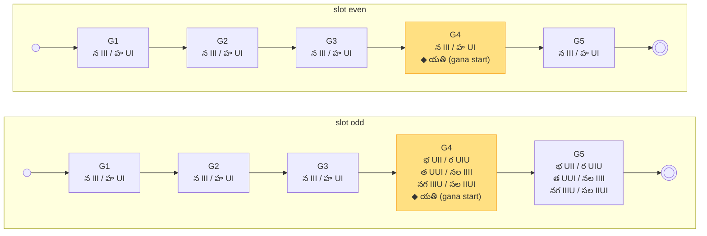

# ఆటవెలది · ataveladi

```mermaid
flowchart LR
  subgraph odd["slot odd"]
    direction LR
    odd_start(( ))
    odd_G1["G1<br/>న III  /  హ UI"]
    odd_start --> odd_G1
    odd_G2["G2<br/>న III  /  హ UI"]
    odd_G1 --> odd_G2
    odd_G3["G3<br/>న III  /  హ UI"]
    odd_G2 --> odd_G3
    odd_G4["G4<br/>భ UII  /  ర UIU<br/>త UUI  /  నల IIII<br/>నగ IIIU  /  సల IIUI<br/>◆ యతి (gana start)"]
    odd_G3 --> odd_G4
    odd_G5["G5<br/>భ UII  /  ర UIU<br/>త UUI  /  నల IIII<br/>నగ IIIU  /  సల IIUI"]
    odd_G4 --> odd_G5
    odd_end((( )))
    odd_G5 --> odd_end
  end
  subgraph even["slot even"]
    direction LR
    even_start(( ))
    even_G1["G1<br/>న III  /  హ UI"]
    even_start --> even_G1
    even_G2["G2<br/>న III  /  హ UI"]
    even_G1 --> even_G2
    even_G3["G3<br/>న III  /  హ UI"]
    even_G2 --> even_G3
    even_G4["G4<br/>న III  /  హ UI<br/>◆ యతి (gana start)"]
    even_G3 --> even_G4
    even_G5["G5<br/>న III  /  హ UI"]
    even_G4 --> even_G5
    even_end((( )))
    even_G5 --> even_end
  end
  classDef yati fill:#ffe082,stroke:#f9a825;
  class odd_G4,even_G4 yati;
```
