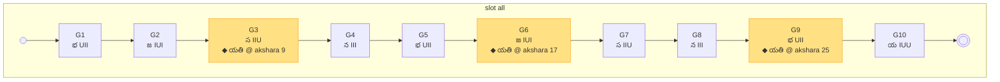

# లయగ్రాహి · layagrahi

```mermaid
flowchart LR
  subgraph all["slot all"]
    direction LR
    all_start(( ))
    all_G1["G1<br/>భ UII"]
    all_start --> all_G1
    all_G2["G2<br/>జ IUI"]
    all_G1 --> all_G2
    all_G3["G3<br/>స IIU<br/>◆ యతి @ akshara 9"]
    all_G2 --> all_G3
    all_G4["G4<br/>న III"]
    all_G3 --> all_G4
    all_G5["G5<br/>భ UII"]
    all_G4 --> all_G5
    all_G6["G6<br/>జ IUI<br/>◆ యతి @ akshara 17"]
    all_G5 --> all_G6
    all_G7["G7<br/>స IIU"]
    all_G6 --> all_G7
    all_G8["G8<br/>న III"]
    all_G7 --> all_G8
    all_G9["G9<br/>భ UII<br/>◆ యతి @ akshara 25"]
    all_G8 --> all_G9
    all_G10["G10<br/>య IUU"]
    all_G9 --> all_G10
    all_end((( )))
    all_G10 --> all_end
  end
  classDef yati fill:#ffe082,stroke:#f9a825;
  class all_G3,all_G6,all_G9 yati;
```
