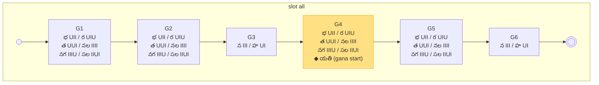

# మధ్యాక్కర · madhyakkara

```mermaid
flowchart LR
  subgraph all["slot all"]
    direction LR
    all_start(( ))
    all_G1["G1<br/>భ UII  /  ర UIU<br/>త UUI  /  నల IIII<br/>నగ IIIU  /  సల IIUI"]
    all_start --> all_G1
    all_G2["G2<br/>భ UII  /  ర UIU<br/>త UUI  /  నల IIII<br/>నగ IIIU  /  సల IIUI"]
    all_G1 --> all_G2
    all_G3["G3<br/>న III  /  హ UI"]
    all_G2 --> all_G3
    all_G4["G4<br/>భ UII  /  ర UIU<br/>త UUI  /  నల IIII<br/>నగ IIIU  /  సల IIUI<br/>◆ యతి (gana start)"]
    all_G3 --> all_G4
    all_G5["G5<br/>భ UII  /  ర UIU<br/>త UUI  /  నల IIII<br/>నగ IIIU  /  సల IIUI"]
    all_G4 --> all_G5
    all_G6["G6<br/>న III  /  హ UI"]
    all_G5 --> all_G6
    all_end((( )))
    all_G6 --> all_end
  end
  classDef yati fill:#ffe082,stroke:#f9a825;
  class all_G4 yati;
```
