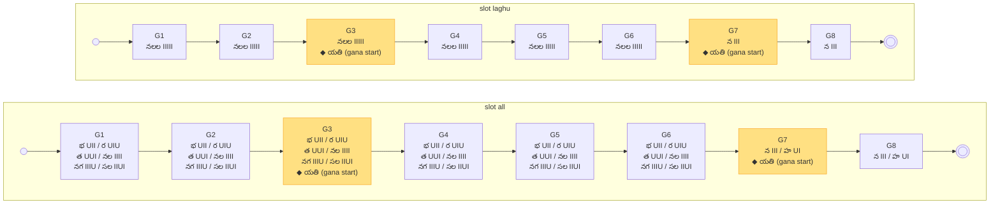

# సీసము · seesamu

```mermaid
flowchart LR
  subgraph all["slot all"]
    direction LR
    all_start(( ))
    all_G1["G1<br/>భ UII  /  ర UIU<br/>త UUI  /  నల IIII<br/>నగ IIIU  /  సల IIUI"]
    all_start --> all_G1
    all_G2["G2<br/>భ UII  /  ర UIU<br/>త UUI  /  నల IIII<br/>నగ IIIU  /  సల IIUI"]
    all_G1 --> all_G2
    all_G3["G3<br/>భ UII  /  ర UIU<br/>త UUI  /  నల IIII<br/>నగ IIIU  /  సల IIUI<br/>◆ యతి (gana start)"]
    all_G2 --> all_G3
    all_G4["G4<br/>భ UII  /  ర UIU<br/>త UUI  /  నల IIII<br/>నగ IIIU  /  సల IIUI"]
    all_G3 --> all_G4
    all_G5["G5<br/>భ UII  /  ర UIU<br/>త UUI  /  నల IIII<br/>నగ IIIU  /  సల IIUI"]
    all_G4 --> all_G5
    all_G6["G6<br/>భ UII  /  ర UIU<br/>త UUI  /  నల IIII<br/>నగ IIIU  /  సల IIUI"]
    all_G5 --> all_G6
    all_G7["G7<br/>న III  /  హ UI<br/>◆ యతి (gana start)"]
    all_G6 --> all_G7
    all_G8["G8<br/>న III  /  హ UI"]
    all_G7 --> all_G8
    all_end((( )))
    all_G8 --> all_end
  end
  subgraph laghu["slot laghu"]
    direction LR
    laghu_start(( ))
    laghu_G1["G1<br/>నలల IIIII"]
    laghu_start --> laghu_G1
    laghu_G2["G2<br/>నలల IIIII"]
    laghu_G1 --> laghu_G2
    laghu_G3["G3<br/>నలల IIIII<br/>◆ యతి (gana start)"]
    laghu_G2 --> laghu_G3
    laghu_G4["G4<br/>నలల IIIII"]
    laghu_G3 --> laghu_G4
    laghu_G5["G5<br/>నలల IIIII"]
    laghu_G4 --> laghu_G5
    laghu_G6["G6<br/>నలల IIIII"]
    laghu_G5 --> laghu_G6
    laghu_G7["G7<br/>న III<br/>◆ యతి (gana start)"]
    laghu_G6 --> laghu_G7
    laghu_G8["G8<br/>న III"]
    laghu_G7 --> laghu_G8
    laghu_end((( )))
    laghu_G8 --> laghu_end
  end
  classDef yati fill:#ffe082,stroke:#f9a825;
  class all_G3,all_G7,laghu_G3,laghu_G7 yati;
```
